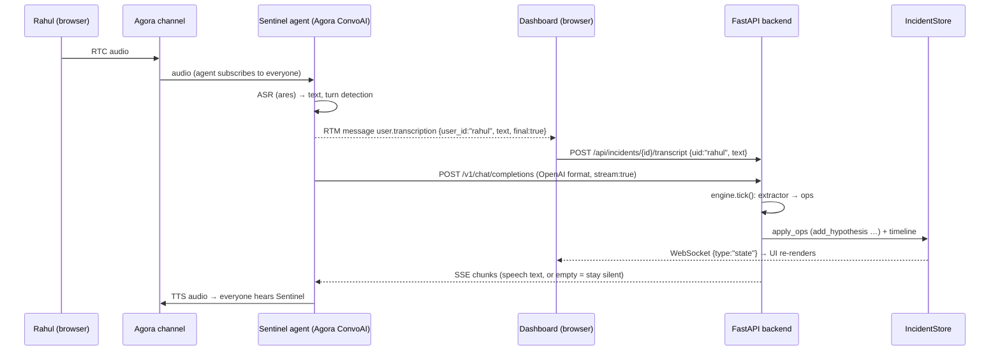

# Sentinel — how it works, end to end

This document explains what each piece is, **why** it exists, and how a single sentence spoken in the
war room travels through the system and comes back as structured incident state (and sometimes speech).

---

## 1. The five layers

| Layer | Tech | Role | Why this choice |
|---|---|---|---|
| **Voice** | Agora RTC + Agora Conversational AI Engine + Agora RTM | Humans talk in a channel; Sentinel joins the same channel as an agent that does ASR → (our LLM) → TTS | The hackathon core requirement; Agora already solves turn-taking, interruption, ASR/TTS vendors, and multi-party audio. We don't rebuild any of that. |
| **Brain** | FastAPI (Python, asyncio) | Turns transcript + monitoring into state ops, decides when to speak, drives tools | Async-first (WebSocket fan-out, SSE streaming, background loops) with almost no boilerplate. Pydantic gives us a typed state model for free. |
| **Memory** | In-memory `IncidentStore` (Pydantic models) + WebSocket event bus | The *single source of truth*: facts, hypotheses, actions, decisions, conflicts, unknowns, risks, timeline, approvals | Everything the AI "knows" must be inspectable and replayable. Every mutation goes through one function (`apply_ops`) so the timeline is always complete. |
| **Hands** | Tool Gateway + adapters (Slack, Jira, PagerDuty, deploy, monitoring) | The only path from AI to the outside world | The LLM never calls an API. It *proposes*; the gateway classifies (safe/critical), blocks critical ones until a human approves, executes, audits. |
| **Face** | Next.js 16 + zustand + Agora Web SDKs | War-room dashboard: timeline, state, confidence, approvals, voice controls | React for live-updating UI; zustand for a tiny store fed by one WebSocket; Agora Web SDK for mic + RTM transcript stream. |

The important design principle behind all of it: **the AI must distinguish what the team knows from what it
believes**, and **it must never act on production without a human**. Everything below serves those two rules.

---

## 2. Life of a sentence

Rahul says into his mic: *"I think the database is overloaded."*



Step by step:

1. **Audio in.** Every human joins the Agora RTC channel from the dashboard (`useAgoraRoom.ts`). The Sentinel
   agent is started by the backend with `POST …/join` (`app/core/agora.py`) and `remote_rtc_uids: ["*"]` so it
   listens to everyone.

2. **Two copies of the transcript, on purpose.** Agora produces the transcript once, but we consume it twice:
   - Over **RTM** as `user.transcription` messages — these carry `user_id`, which is the only place the
     *speaker* is identified. The dashboard forwards final lines to `/api/incidents/{id}/transcript`.
   - Through the **custom-LLM call** — Agora calls our `/v1/chat/completions` as if we were OpenAI. This request
     does *not* include the speaker, but it is the signal that "a turn just ended, you may reply now".

   The backend de-duplicates (`engine.ingest_transcript` drops an identical line from the same uid within 20 s)
   and waits 400 ms in the LLM endpoint so the attributed RTM copy usually lands first.

3. **Tick.** `engine.tick()` (`app/engine/engine.py`) takes all pending lines and monitoring events since the last
   tick, runs the **extractor**, applies the resulting ops, runs deterministic **state rules**, recomputes the
   **confidence matrix**, and returns an **intervention** decision.

4. **Reply or stay silent.** If the intervention is `WAIT`, the SSE stream returns empty content and the agent says
   nothing. Otherwise the text is streamed back and Agora speaks it. For speech that isn't a reply to a turn
   (overdue action, monitoring alert) the backend calls `POST …/agents/{id}/speak` instead.

5. **Everyone sees it.** The store broadcasts a full `state` snapshot on every mutation; the dashboard store
   (`useIncident.ts`) swaps it in and React re-renders timeline, tabs, confidence bars, evidence graph.

---

## 3. The extractor: sentences → ops

`app/engine/extractor.py` has two implementations with the same signature:

- **`llm_extract`** — sends the state digest + new lines to the model with `EXTRACTION_SYSTEM`
  (`app/llm/prompts.py`) and asks for JSON: `{"ops": [...], "intervention": {...}}`.
- **`RuleExtractor`** — regex/keyword rules for the same op set. Runs when there is no `LLM_API_KEY`, or if the LLM
  call fails. It keeps the demo deterministic and offline.

**Why "ops" instead of letting the model rewrite the state?** The model emits small, typed instructions such as
`add_hypothesis`, `update_action`, `add_conflict`, `propose_tool`. The store applies them (`IncidentStore._apply`)
with de-duplication, id resolution, and a timeline entry per change. That gives us:

- an audit trail (every change is an event with a timestamp),
- protection against hallucinated rewrites (the model cannot delete a fact or flip a status silently),
- one code path for both extractors and for the deterministic rules.

Key rules baked into the prompt and the regex extractor:

| Utterance | Op | Rationale |
|---|---|---|
| "I think / probably / I suspect …" | `add_hypothesis` (never `add_fact`) | Belief, not knowledge |
| "Rahul, check the pool." / "I'll check the deploy history." / "Someone check …" | `add_action` with owner / self / **null** | Ownership tracking; unowned actions get chased |
| Owner says "confirmed / is exhausted / just checked" | `update_action done` + evidence on matching hypothesis | Closes the loop between task and finding |
| Commander: "let's freeze deployments" | `add_decision` | Decision ledger |
| "rollback / restart / failover …" | `propose_tool` | Goes to the gateway, never executed directly |
| Two people, same topic, opposite polarity | `add_conflict` | See §5 |

---

## 4. Deterministic rules the LLM is *not* allowed to do

Some things are too important to trust to a language model, so `engine.py` does them in plain Python:

- **Metrics → facts** (`_metric_rules`): "payment success rate dropped to 21%" becomes a fact with
  `source: monitoring` evidence — the number comes from the monitoring adapter, never from the model.
- **Hypothesis evidence**: when DB utilization ≥ 95 %, every open hypothesis mentioning db/pool/connection gets
  monitoring evidence and moves to `investigating` (not `confirmed`).
- **Unknowns**: blast radius (regional?), auth affected?, "did v4.2 cause it?", "is rollback safe?" are added
  automatically and answered automatically when data arrives (auth success 99.6 % → answered).
- **Recovery**: success rate crossing back above 95 % → fact, `status: recovered`, risks ("root cause not
  conclusively established"), and safe follow-up tools (Slack status, Jira ticket).
- **Conflict resolution**: once a pool/database hypothesis is confirmed, the "healthy vs 100 %" conflict is
  resolved with an explanation.

---

## 5. Conflict detection

`RuleExtractor` keeps `claims[topic] = [(uid, polarity, text)]`. Each sentence is mapped to a topic
(database health, deployment, authentication, region, cache) and a polarity (+1 "healthy/fine", −1
"exhausted/100 %/failing"). A new claim whose polarity differs from a *different person's* prior claim on the same
topic creates one `add_conflict` and a `WARN` intervention:

> "I want to flag conflicting information about database health. Ananya reported 'Database looks healthy…', but
> Rahul reports 'Connection pool is exhausted'. Can someone verify before we treat this as settled?"

Sentinel does not pick a side. It asks for verification, and the conflict stays open until evidence resolves it.

---

## 6. Hypothesis lifecycle (the fact/hypothesis engine)

```
unverified ──(monitoring evidence)──▶ investigating ──(monitoring + human confirmation)──▶ confirmed ──▶ becomes a Fact
     └──(contradicting evidence)──▶ rejected
```

A hypothesis becomes **confirmed only when both** a monitoring/tool evidence item **and** a participant
confirmation are attached. In the rule extractor this is literally `has_monitoring = any(e.source == "monitoring")`
before allowing `status: confirmed`. Recovery after rollback adds evidence to the *deployment* hypothesis but keeps
it at `investigating` with 60 % — correlation, not proof — which is why the final report says root cause is not
conclusively established.

---

## 7. Intervention engine: should Sentinel speak?

Every tick produces `{action, speech, urgency}` with action ∈ `WAIT | ASK | WARN | SUMMARIZE | CLARIFY | PROPOSE`.

- `WAIT` → silence. The default when the conversation is productive.
- `WARN` → conflict or someone treating a belief as fact.
- `ASK` → critical unknown or an action with no owner.
- `SUMMARIZE` → major state change (hypothesis confirmed, recovery).
- `PROPOSE` → a next step that needs human approval.
- `CLARIFY` → someone addressed Sentinel directly ("Sentinel, status?") → `report.status_speech()`.

A throttle (`MIN_GAP_S = 8`) suppresses non-urgent speech; `urgency: high` always goes through with
`priority: INTERRUPT` on the Agora speak API.

A background **follow-up loop** (every 10 s) speaks on its own when an in-progress action is stale (> 90 s),
an action is unowned (> 30 s), or an approval has been pending (> 45 s). That is the "coordination, not
transcription" part.

---

## 8. Tool gateway and human-in-the-loop

```
LLM / rules ──▶ propose_tool ──▶ gateway.propose()
                                     ├─ risk = safe     ──▶ execute now (Slack, Jira, PagerDuty page, monitoring query)
                                     └─ risk = critical ──▶ ToolProposal(pending) ──▶ dashboard modal
                                                               ▼ human clicks Approve/Reject
                                                          gateway.decide() ──▶ Decision ledger entry ──▶ execute()
                                                                                       │
                                                                                       ▼ policy re-check: critical + "policy:auto" ⇒ REJECT
                                                                                       ▼ adapter (real API if creds, mock otherwise)
                                                                                       ▼ result → timeline + state
```

The policy is checked twice (at proposal and at execution) so that even a buggy caller cannot auto-run a rollback.
`tests/test_scenario.py::test_critical_tool_cannot_auto_execute` asserts this.

Adapters are real when credentials exist (`SLACK_BOT_TOKEN`, `JIRA_*`, `PAGERDUTY_*`) and realistic mocks otherwise,
so the demo is never blocked on integrations. The mock `Deploy.rollback` drives the mock monitoring back to
baseline, which is what makes "approve → recovery" visible end to end.

---

## 9. Confidence matrix

`app/engine/confidence.py` computes six numbers **from state**, never from the model:
customer impact, outage scope, primary finding, change correlation, root cause, recovery. Root cause only rises
above ~45 % when a *causal* hypothesis (mentions deploy/change/config/version) is confirmed. Open conflicts
discount the primary-finding score. This is what lets Sentinel say "high confidence on impact, low confidence on
root cause" honestly.

---

## 10. Report and demo

- `report.generate()` renders a deterministic Markdown report from state (and, when an LLM key exists, a prose
  version on top). Sections: impact, findings with evidence, hypotheses with status, decision ledger, actions by
  owner, tool executions, unresolved risks, open questions, conflicts, confidence, timeline.
- `app/mock/scenario.py` is the PRD's payment-outage script. It feeds lines into **the same pipeline** as live
  voice (`ingest_transcript` → `tick`), so the demo is a real run, not a canned animation. `await_approval`
  blocks until a human decides on the rollback.

---

## 11. Frontend data flow

```
WebSocket /ws/incidents/{id}
   ├─ {type:"state", incident}      → useIncident.incident (full snapshot; simple + always consistent)
   ├─ {type:"transcript", line}     → useIncident.transcript
   ├─ {type:"sentinel", text}       → sentinelQueue → browser speechSynthesis (only when no Agora agent is in the room)
   └─ {type:"metrics", metrics}     → history (sparklines)
```

`useAgoraRoom.ts` joins RTC, publishes the mic, plays remote audio (including the agent's TTS), subscribes to RTM
and forwards `user.transcription` lines. If Agora credentials are absent it falls back to the browser's
SpeechRecognition for input and speechSynthesis for output, so the same UI works in all three modes:

| Mode | Input | Brain | Output |
|---|---|---|---|
| Offline (no keys) | typed / browser STT / scripted demo | rule extractor | browser TTS |
| LLM only | same | LLM extractor (rules as fallback) | browser TTS |
| Live Agora | Agora ASR, speaker-attributed via RTM | LLM or rules | Agora TTS in the voice room |

---

## 12. Why not just summarize the transcript with an LLM?

Because a summary is not a shared source of truth. It cannot be queried, it silently promotes beliefs to facts,
it has no notion of ownership, and it cannot be audited after the incident. Sentinel's state model, evidence links,
decision ledger, and gateway are what turn "an AI in the call" into "an incident commander you can trust".
